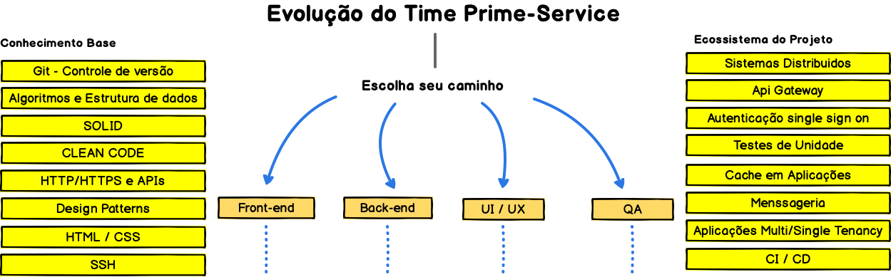
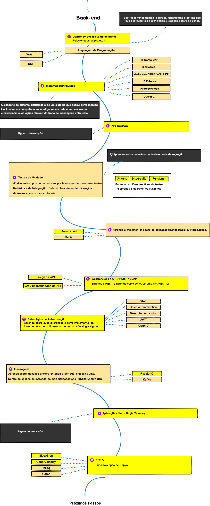

  
  <h2 align="center">Roadmap Evolução Time Prime Service</h2>
  
Esse Rodmap é uma proposta para o desenvolvimento técnico do time PrimeService 

   

## Objetivo
> O objetivo deste roadmap é dar uma ideia sobre o atual ecossistema das tecnologias envolvidas no projeto Prime Service e orientar os desenvolvedores na evolução tecnologica dentro do time.

## Introdução

## Frontend Roadmap

<!--  -->

## Back-end Roadmap

## UX/UI Roadmap

<!--  -->

## QA Roadmap

<!--  -->

 
## 🙌 Colabore

>  Para colaborar [colaborando.md](./colaborando.md) 

